# インタープリタの役割、全部入り

以上の [word分割](./word_breaking_and_quoting.md)、[置換](./substitution.md)、[展開](./arg_expansion.md)を一つにまとめるとこの図のようになります。

この図は先のページの例の、 `string {*}$bar 3` の行を Tcl インタープリターが
解釈する様子を表したものです。

```tcl
set bar {repeat foo}
string {*}$bar 3
# => foofoofoo
```



