# Tcl インタープリタとコマンドの word分割

ここでコマンドが Tcl に実行される過程を一段階詳しく掘り下げてみましょう。
コマンドは Tcl インタープリターと呼ばれるプログラムによって解釈され、
その結果として `string repeat` などの具体的な機能が呼び出される仕組みに
なっています。Tcl のプログラムを正しく読み書き出来るためには、
この Tcl インタープリタが果たす役割を理解する必要があります。

Tcl インタープリタは、プログラムを受け取ると、
その字面を流し読みし、空白文字や改行、コメントを見分けます。
そして一回分のコマンドとなる、コマンド名と引数の並びを
（インタープリタの中の、隠されたリストに）格納します。
（以後この作用を **コマンドの word 分割** と呼びます）

その後、そのリストの先頭要素がコマンド名としてコマンド辞書の検索に使われ、
コマンドの実体が取り出されます。
そして最後に、コマンドの実体に対して残りの引数列が渡されます。

<small>（Tcl インタープリターには、あと２つ、置換(substitution)と展開(argument expansion)という重要な役割があります）</small>

