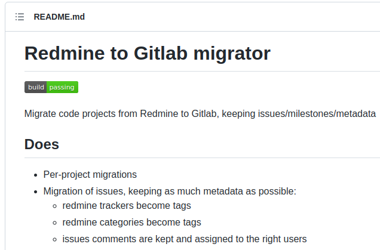

## Gitea, Redmine, CVSTrac から

## GitLab へのデータ移行で得た**個人的**知見を駆け足で

 **@hkoba**

* <small>(名ばかりの)</small>フリーランス・プログラマ
  - <small>普段の業務は Perl, TclTk, Zsh, Emacs Lisp</small>

<!-- 
hkoba と申します。名ばかりのフリーランスプログラマしてます。
今日は
〜発表させて頂きます。
-->
---

# お断り

- あくまで個人的な成功事例


  - 今後もうまく行くか→不明
  - YMMV


<!--
はじめにお断りです。この話はあくまで個人的な成功事例です。
今後もうまく行くとは保証できません。ご了承下さい。
-->
---

## 私の Issue Tracker 運用歴(self host)

|システム|利用開始|状況|
|-|-|-|
|[CVSTrac](http://www.cvstrac.org/home/doc/trunk/www/index.html)|2005〜|今はIssue管理とWikiのみ、ただし最重要コードベース<br>移行手順の構築途上|
|[Redmine](https://redmine.org/)|2012〜|一部残存|
|[Phabricator](https://www.phacility.com/phabricator/)|2019〜|廃止|
|[Gitea](https://gitea.io/en-us/)|2020〜|廃止|
|…そして **GitLab** |2021〜||

<!-- 
さて、私が初めて運用した Issue Tracker は CVSTrac でした。本当は早く廃止したいのですが、今も最重要なコードの Issue 管理を担っています。
脱出先の候補として、様々な Issue Tracker をサイドプロジェクト用に試しました。その末に、たどり着いたのが GitLab というわけです。
-->
---
# Gitea からのデータ移行、どうだった？

<!--で実際、〜 -->
---

## 最初は[公式機能](https://docs.gitlab.com/ee/user/project/import/gitea.html#import-your-project-from-gitea-to-gitlab)を試した

* Web 画面から gitea の API token を入れるだけで動く
  - プロジェクト数が多いとWeb 画面の操作が大変

* リポジトリ → OK
* issue → 多いと取りこぼす  
 <small>（github API 用のコードを gitea にも転用しているため、ページャの仕様違いで問題発生）</small>
* 未対応？
  - PR 上のコードレビューのコメント
  - Commit からの issue 参照が、issue 側に反映されない

<!--
最初は公式機能を試しました。

Web画面に gitea の url と API token を入力すれば、gitea 上のリポジトリが表示されて、それを選んで移行ボタンを押すだけです。簡単に使えます。

で、リポジトリの移行は大丈夫だったのですが、

issue は、数が多いと取りこぼす

Pull Request 上のコードレビューコメントが捨てられる
Commit メッセージで issue 参照を書いても、issue 側からは commit が見えない

など、不満がありました。
-->
---

# 取りこぼしデータは諦める？ …は嫌！

* データは、システムよりも大事！


  * 新人教育のコードレビューのやり取りが失われるとか、全力で回避したい

---

# どうする？

* GitLab のコードベースは巨大

* けど結局は Rails アプリ
* gitlab-rails console で対話的に実験できる
  - ActiveRecord ベースのモデル群
  - API Client
* <small>※起動に40秒ほど必要</small>
---

## メインの仕事の合間に rails console

## gitlab から切り出したコード断片をチマチマ投入実験

## 〜16週間

---

## 余談

gitlab公式から切り貼りして出来たコード、仮に公開するなら適切な場は？
ライセンスはどうすれば？  
（アドバイス求む）（なお当方、業務で初ruby）

---

## どう解決したか(1/4)

→公式の Importer を継承してページャを差し替え、問題を修正

```ruby
module GiteaImport
  class Client < Gitlab::LegacyGithubImport::Client
    def request(method, *args, &block)
    def each_response_page(method, args, last_response)

  class ProjectImporter
    def execute
```


---

## どう解決したか(2/4)

```ruby
puts "Importing repo devteam/NRA2/yllib1"
imp = GiteaImport::ProjectImporter.new(clnt, root, {
    import_source: 'devteam/yllib1', 
    target_namespace: 'devteam/NRA2', 
    new_name: 'yllib1',
})
imp.execute
```

→足りない機能は ActiveRecord を直接叩く

```ruby
proj15 = imp.project

review5 = Review.create!(
  author: (User.find_by_email 'foobar@example.com'), 
  project: proj15, 
  merge_request: MergeRequest.find_by(project: proj15, iid: 2), 
  created_at: '2021-05-28T03:54:40Z')
```
---
## どう解決したか(3/4)

→ それを呼び出す ruby スクリプトを Gitea 側の DB データから生成

```sh
./GiteaQuery.pm generate_repo_importer \
  $mygroup > importer.rb

# 生成ツールの中身は perl なので自粛
```

---

## どう解決したか(4/4)

gitlab-rails runner に食わせる

```sh
sudo gitlab-rails runner $PWD/impoter.rb
```

<small>もちろん、最初は gitlab-rails console から `load` で少しずつ結果を確認しながら合わせ込み</small>

---

# 次：Redmine からのデータ移行、どうだった？

---

## 普通なら既存のツールを使うほうが良さそう

[](https://github.com/redmine-gitlab-migrator/redmine-gitlab-migrator)

---

## 今回は、ネットワーク的に使いづらい事情があった

- redmine は社内ネットワーク
  - パンデミック下で出社したくない
- うちの GitLab はゼロトラスト化のため GCP 上の Identity-Aware Proxy 保護下

## 加えて

* 後の CVSTrac 移行のためにも、自力で直接モデルを叩く方法を実験したかった
---
## どう解決したか

redmine の SQLite の db だけ持ち帰り、gitea の時と同じように、import用 ruby スクリプトを生成

### issue とコメント
```ruby
issue10 = Issue.create!(author: User.find_by_email('foobar@example.com') || User.find(1),
 project: Project.find_by_full_path('foobar/issues'),
 closed_at: '2019-11-08T08:49:04Z',
 iid: 10,
 state: :closed,
 created_at: '2019-05-17T06:08:51Z',
 title: 'アンケート本体の全体タスク',
 description: '',
 updated_at: '2019-11-08T08:49:04Z')

Note.create!(project: (Project.find_by_full_path 'foobar/issues'),
 noteable: issue10,
 author: User.find_by_email('foobar@example.com') || User.find(1),
 created_at: '2019-11-08T08:49:04Z',
 note: '分類を変えたので、閉じます。')
```
---

### issue 同士の親子関係
```ruby
prj = Project.find_by_full_path 'foobar/issues'

IssueLink.create!(source: prj.issues.find_by_iid(1),
 target: prj.issues.find_by_iid(3),
 created_at: '2019-05-17T06:08:50Z')
IssueLink.create!(source: prj.issues.find_by_iid(2),
 target: prj.issues.find_by_iid(3),
 created_at: '2019-05-17T06:08:50Z')
```

### グループ全体の issue 数が狂うのでキャッシュを再計算
```ruby
prj = Project.find_by_full_path 'foobar/issues'
o = Projects::OpenIssuesCountService.new(prj)
o.count
o.refresh_cache
o.count
```

---

# 最後：CVSTrac からのデータ移行

- Issue, Note, IssueLink ... を作る
- 時系列の通りに create する必要があるぽい
* （以下略
---

## まとめ

- データはプログラムよりも重く尊い
  - 泥臭い手段でも、移行を実現できれば勝ち、価値がある

- LL で記述された CMS は import ターゲット向き
  - REPL （rails console）上で実験・検証しながら進められる
- プログラムとして export し、実行で import
  - ActiveRecord を叩くだけで、大体なんとかなる
    - ただし再試行時には gitlab各所のキャッシュを把握しクリアする必要


---

# おまけ

---

## なぜ GitLab を選んだ?

- グループ機能
  - ex. `チーム/プロジェクト/リポジトリ`
    - git submodule の相対URIで重要
    - issue 参照も ex. `X/Y/Z#番号`
  - 可視性・グループ参加可否の制御<small>（の階層化・権限委譲）</small>
- Self host で始められる
  - [Identity-Aware Proxy](https://cloud.google.com/iap) の背後に設置<small>（public でも安全→全社DX基盤化）</small>
  - 無課金スタート→実績積み
