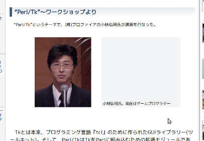
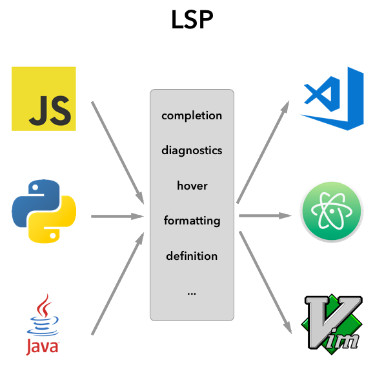

## Perl で Language Server を

### 書いてる話

**@hkoba** [hkoba.github.io](http://hkoba.github.io/)
→ [`Gotanda.pm` `#19`](http://hkoba.github.io/slides/gotandapm19/)

---

### 自己紹介: hkoba

* <small>(名ばかりの)</small>フリーランス・プログラマ
  * <small>1995〜1998 頃に Perl/Tk の日本語化してた人</small>

<small>The Perl Conference Japan で lwall にセラムンのポスターをプレゼントしたり</small>

---

## あらすじ

1. Language Server (<em>LS</em>) とは
2. 今回書いた LS の概要
3. どうやって開発したか？

---

## お断り

* 何の権威もございません
* 厳密な話は公式サイトをご確認下さい

---

### [Language Server (<em>LS</em>)](https://langserver.org/) とは

* 言語の開発支援ツールを
* エディタから独立して実装するための枠組み （通信プロトコル: <small>[Language Server Protocol](https://microsoft.github.io/language-server-protocol/)</small>）

---

### 言語の開発支援機能とは

* 定義個所へのジャンプ
* 引数仕様の確認
* 構文エラーの検査
* …

---

### LSP が無かった頃

<small class="medium">
`言語の開発支援ツールを書く人`の悩み： 
様々なエディタをサポートしたいが、 APIが全部違う 
 
 
`エディタ開発者`の悩み: 
様々な言語の開発支援ツールをサポートしたいが、 APIが全部違う
</small>

* 組合せに個別に対応する無駄が起きていた。

---

### LSP 登場

* <small>LS (LSP サーバー) = 開発支援機能を LSP に基づき提供する</small>
* <small>LSP クライアント = エディタ(LSP に基づき LS の開発支援機能を利用)</small>

---

