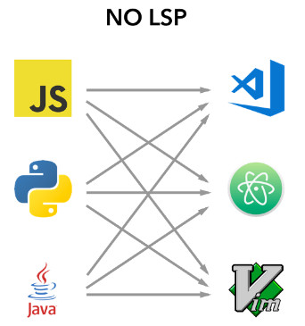

## Perl で Language Server を

### 書いてる話


**@hkoba** [hkoba.github.io](http://hkoba.github.io/)
→ [`Gotanda.pm` `#19`](http://hkoba.github.io/slides/gotandapm19/)

---

## お断り

* LSP の厳密な話は[公式サイト](https://microsoft.github.io/language-server-protocol/)をご確認下さい

---

### 自己紹介: hkoba

* <small>(名ばかりの)</small>フリーランス・プログラマ
  * <small>1995〜1998 頃に Perl/Tk の日本語化してた人</small>
* テンプレートエンジン [YATT::Lite](https://github.com/hkoba/yatt_lite#yattlite---template-with-use-strict-) を作ってます

___


<small>The Perl Conference Japan で lwall にセラムンのポスターをプレゼントしたり</small>

[](https://ascii.jp/elem/000/000/313/313635/)


---

## あらすじ

1. Language Server (<em>LS</em>) とは
2. 今回書いた LS の概要
3. どうやって開発したか？

---

## 1. [Language Server (<em>LS</em>)](https://langserver.org/) とは

---

### [Language Server (<em>LS</em>)](https://langserver.org/) とは

* 言語の開発支援ツールを
* エディタから独立して実装するための枠組み<br>（通信プロトコル: <small>[Language Server Protocol](https://microsoft.github.io/language-server-protocol/)</small>）

---

### 言語の開発支援機能とは

* 定義個所へのジャンプ
* 引数仕様の確認
* 構文エラーの検査
* …

---

### LSP が無かった頃



<small class="xx-justify-left">
`言語の開発支援ツールを書く人`の悩み：<br>
様々なエディタをサポートしたいが、<br>APIが全部違う<br>
<br>
<br>
`エディタ開発者`の悩み:<br>
様々な言語の開発支援ツールをサポートしたいが、<br>APIが全部違う
</small>


* 組合せに個別に対応する無駄が起きていた。

---

### LSP 登場


* <small>LS (LSP サーバー) = 開発支援機能を LSP に基づき提供する</small>
* <small>エディタ (LSP クライアント) = LSP に基づき LS の開発支援機能を利用</small>

---

## 2. 書いた<small>(書いてる)</small> LS の概要

---

### 今回書いた<small>(書いてる)</small> LS

* 自作テンプレートエンジン [YATT::Lite](https://github.com/hkoba/yatt_lite#yattlite---template-with-use-strict-) の LS


[YATT::Lite::LanguageServer](https://github.com/hkoba/yatt_lite/blob/dev/Lite/LanguageServer.pm)

- - - -
<small>(※ まだ github のみ公開, CPAN はもっと先…)</small>

___

接続を確認したエディタ(LSPクライアント)

* Emacs (emacs-lsp)
* VS Code

---

## デモ

---

### 動いた<small>(<em>※</em>)</small>API

<dl>
<dt>[textDocument/hover](https://microsoft.github.io/language-server-protocol/specification#textDocument_hover)</dt>
<dd class="small">カーソル下の記号の概要を表示</dd>
<dt>[textDocument/implementation](https://microsoft.github.io/language-server-protocol/specification#textDocument_implementation)</dt>
<dd>定義個所へのジャンプ</dd>
<dt>[textDocument/publishDiagnostics](https://microsoft.github.io/language-server-protocol/specification#textDocument_publishDiagnostics)</dt>
<dd>構文エラーを LS からエディタへ通知</dd>
<dt>[textDocument/didChange](https://microsoft.github.io/language-server-protocol/specification#textDocument_didChange)</dt>
<dd>エディタ上の更新をリアルタイムで受信</dd>
</dl>

- - - - -

<small>(<em>※</em> もちろんヨチヨチ歩きですヨ！)</small>


---

### 3. どう開発を進めたの？

---

#### 心がけたこと

* コンパイル時にエラーを検出可能な書き方<br>
<small>(method not found を減らす)</small>
* コマンド行から各機能を直接試せるように<br>
<small>(REPL の代わり。デバッガも呼びやすくなる)</small>

---


1. 参考になる実装を探し読み解く
2. エディタから LS を起動できる状況を作り、
[initialize](https://microsoft.github.io/language-server-protocol/specification#initialize) を受け取れるようにする
3. プロトコル仕様書を機械可読な形に変換する
4. Perl の型情報([fields](https://metacpan.org/pod/fields))を生成する
5. まずは [hover](https://microsoft.github.io/language-server-protocol/specification#textDocument_hover) を動くようにする。
   * <small>そのために、言語の構文木の実装も変更する</small>


---

### 参考にした実装

[Perl::LanguageServer](https://metacpan.org/pod/Perl::LanguageServer)

* 割とベタな書き方だった<small>(ex. [mainloop](https://metacpan.org/release/Perl-LanguageServer/source/lib/Perl/LanguageServer.pm#L233))</small><br>
→読み解いて、自分流に書き直す<small>(ex. [mainloop](https://github.com/hkoba/yatt_lite/blob/22b59cd9c36029e4bab0b4731acafd538f82ab96/Lite/LanguageServer/Generic.pm#L97))</small>

* 初手は JSON RPC 部分から。<small>[こんな感じ](https://github.com/hkoba/yatt_lite/commit/2103016f3da9d92b7a8151e10442c7d42068bcfb)で。</small>

---

### エディタから LS を起動できる状況を作る

* (今の) emacs-lsp なら少し書くだけで ok. <br>
(ex. [lsp-yatt](https://github.com/hkoba/yatt_lite/blob/dev/elisp/lsp-yatt.el))
* VS Code の場合は最初に公式ガイドの [GET STARTED](https://code.visualstudio.com/api/get-started/your-first-extension) でツール環境を整えた後、[LS拡張ガイド](https://code.visualstudio.com/api/language-extensions/language-server-extension-guide)に進む


---

### プロトコル仕様書を<small>(使うところだけでも)</small>機械可読可能に変換する

* （固い仕様があるのに）通信プロトコルの Request/Response オブジェクトを手で実装するのは
ミスの元
* 計算機の力を使いたい。
* [元の仕様書](https://github.com/Microsoft/language-server-protocol/blob/gh-pages/specification.md)は markdown で、その中に typescript で宣言が書かれている
   * ↑これの json 版とか、無いのかしら？

---

* 仕様書の json 版は、見つけられず。
   * <small>絶対にどこかに有るはず、とは思いつつ…</small>
* **不完全でも良い** から、Perl で変換してみる<br>
[YATT::Lite::LanguageServer::SpecParser](https://github.com/hkoba/yatt_lite/blob/dev/Lite/LanguageServer/SpecParser.pm)

---

まず markdown の codeblock のうち、言語ID が typescript である個所を抜き出す

```shell
./SpecParser.pm extract_codeblock typescript specification.md |
```

次に文(`interface`, `namespace`)の一覧を抜き出す。

```shell
./SpecParser.pm cli_xargs_json extract_statement_list |
```

<small>(型の注釈コメントも残しておく)</small>

---

雑に（文を把握できる範囲で）トークンに分解する

```shell
./SpecParser.pm cli_xargs_json --slurp --single tokenize_statement_list |
```

文を解析して、仕様を表すレコードに変換する
```shell
./SpecParser.pm cli_xargs_json --slurp --single parse_statement_list |
```

---

実は `interface ParameterInformation` だけは手抜きで parse 出来ないので、
`grep -v` で除外^^;

全体はこう＞

```shell
./SpecParser.pm extract_codeblock typescript specification.md |
./SpecParser.pm cli_xargs_json extract_statement_list |
grep -v 'interface ParameterInformation'|
./SpecParser.pm cli_xargs_json --slurp --single tokenize_statement_list |
./SpecParser.pm cli_xargs_json --slurp --single parse_statement_list |
jq --slurp . | fx
```

---

次に、ここから Perl の静的検査に使える情報([fields](https://metacpan.org/pod/fields),[constant](https://metacpan.org/pod/constant))を生成

- - - - -

<small>※具体的には自作のタイプビルダー [MOP4Import::Types](https://github.com/hkoba/perl-mop4import-declare/blob/master/Types.pod) 用の宣言を生成。</small>

---


生成結果→ [YATT::Lite::LanguageServer::Protocol](https://github.com/hkoba/yatt_lite/blob/dev/Lite/LanguageServer/Protocol.pm)

- - - - -

<small>※今回のLS に使ったものしか変換していません</small>

---

### Hover を作る

* マウスカーソルの位置<small>(ex. `{line: 3, character: 8}`)</small> がエディタから与えられる
* その場所のシンボルを割り出す
* シンボルから、hover で出すべき開発支援情報を作って返す

- - - -

<small>※構文木に十分な情報が残っていない場合は、元の言語の構文木自体も改良する</small>
