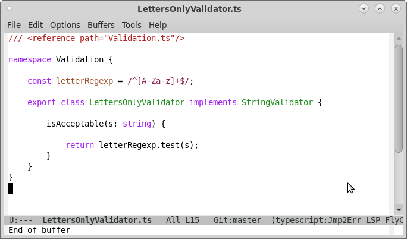
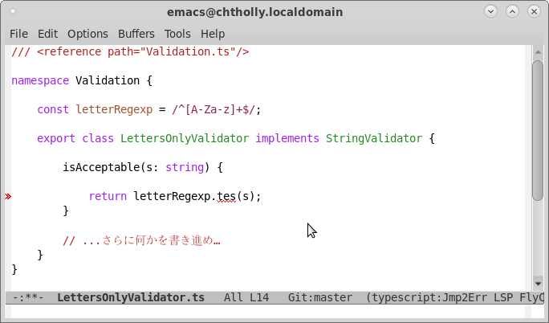
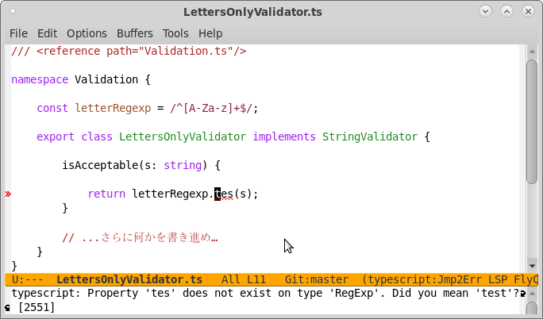

### <small>(天才以外の)</small>人に
## エディタは
## エラーを
### いつ、どう伝えるべきか？

#### 八王子pm74, 2018-11-24

**@hkoba** [hkoba.github.io](http://hkoba.github.io/)

---

### 極めて個人的な、好みの話です

---

今日のサンプルコード

<small>
出典 https://www.typescriptlang.org/docs/handbook/namespaces.html
</small>

<small>与えられた文字列が、アルファベットのみか否かを検査</small>

---

<!-- .slide: class="small" -->

* Emacs
* ＋ flycheck
* ＋ lsp-mode (Language Server Protocol)

---

#### <small>さて</small>

### メソッド名を、typo した

#### <small>とします</small>

---

### flycheck + lsp のエラー通知画面

<small>**素人さんは、気づかないのでは？**</small><!-- .element: class="fragment" -->

---

* 小さすぎる
* 壊れている、のに書き進められる<!-- .element: class="fragment" -->

---

### 壊れたまま
#### 書き進めても大丈夫なのは
## 天才だけなのでは？

---

#### <small>みなさんは</small>

### 素人さんが
### 壊したコードを
### 尻拭いで直した経験は
### ありませんか？

<small>**あれ辛くないですか？**</small><!-- .element: class="fragment" -->

---

#### 壊したら、壊した時点で
## **エディタに**<!-- .element: class="fragment" -->
## 止めて欲しい<!-- .element: class="fragment" -->

---

少なくとも、素人さんに渡す道具には、

### 壊れた時点で、
### それ以上壊さないよう
### 指示を出す機能が欲しい

---

<small>具体的には</small>

* エディタの保存時に
* コードが壊れていたら
* 最初のエラーの行へ
* カーソルを強制で飛ばす

---

* 画面も警告色に変える
  * 直すまで色が消えないようにする

---

#### そんな elisp を書いてました

<small>https://github.com/hkoba/emacs-on-save-jump-to-lsp-error</small>

---

* VS Code でも同じことをしたいので、設定ご存知な方、教えて頂けると嬉しいです

- - - - -

### おしまい
