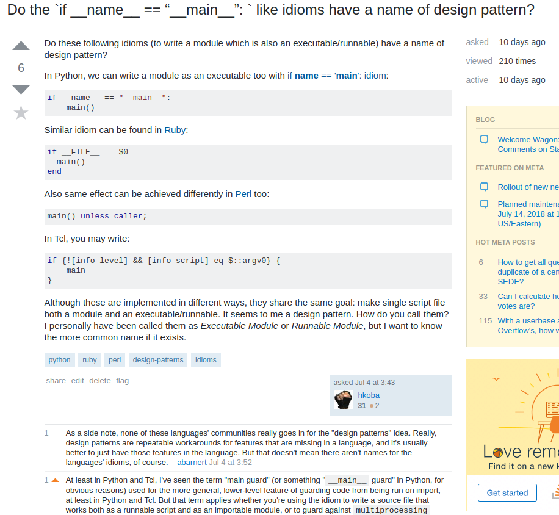

### Runnable Moduleパターン <b class="kari">(仮)</b><small>と</small>
### サブコマンド<small>を組み合わせると</small>
#### どう嬉しいか


**@hkoba** [hkoba.github.io](http://hkoba.github.io/)
→ [`kichijojipm` `#15`](http://hkoba.github.io/slides/kichijojipm15/)

---

## 自己紹介 `@hkoba` 

* <small>(名ばかりの)</small>フリーランス・プログラマー
  * ⇔主に<a style="padding: 0 .3em;" href="https://www.ssri.com/recruit/opbu/"></a>さんのお仕事
  * Perl 書きたいプログラマ、募集中


---

<!-- .slide: class="sparse-list" -->

## 今日の内容

1. Runnable Moduleパターン<b class="kari">(仮)</b>とは？
2. サブコマンドと組み合わせるとどう嬉しいか
3. 更なる深みへ…

___

元記事


<!-- https://twitter.com/hkoba/status/905367840663814145 -->


<small>https://hkoba.hatenablog.com/entry/2017/09/06/185029</small>

___


おまけ

* https://github.com/hkoba/perl-mop4import-declare/blob/master/intro_runnable_module.pod
* https://github.com/hkoba/p5-File-AddInc

---

### お断り

* 広い範囲の言語に適用可能
* ただし、今日は Perl で書きます

___

#### 適用可能な条件

* モジュールが有る<small>(当然)</small>
* `#!` などを用いて、スクリプトを直接実行できる
* モジュールとして呼び出した時と、スクリプトとして呼び出した時の、挙動を変えることが出来る

---

# 1.
## Runnable Moduleパターン<b class="kari">(仮)</b><small>とは？</small>

---

<!-- .slide: class="left-align" -->

#### Runnable Moduleパターン<b class="kari">(仮)</b><small>とは？</small>

<small>(一つのプログラムファイルを)</small>

#### _**モジュール**_ として利用できる
```perl
use ModuleA;
my $obj = ModuleA->new;

$obj->do_something([1, x => 3], [1, y => 8], [1, z => 3], [2, z => 1], [2, x => 1]);
print $obj->as_string, "\n";
```

#### かつ、CLI から _**コマンド**_ として実行もできる
```sh
% ./ModuleA.pm 1:x:3 1:y:8 1:z:3 2:x:1 2:y:2
```

ように書くこと

---

<small>モジュールを</small>

### 書くと

<small>CLIから</small>

### すぐ試せる

---

つまり！

### コード＆レスポンス

ですよ！

---

ファイルの抜粋 ([ex1 - ModuleA.pm](./ex1/ModuleA.pm))

```perl
#!/usr/bin/env perl
package ModuleA;
...

unless (caller) {

  # コマンドとして起動した時の処理

  ModuleA->main(@ARGV)
}

1
```

___


[python](https://stackoverflow.com/questions/419163/what-does-if-name-main-do)

```python
if __name__ == "__main__":
    main()
```

[ruby](https://stackoverflow.com/questions/4687680/what-does-if-file-0-mean-in-ruby)

```ruby
if __FILE__ == $0
  main()
end
```

---

## <small>この用語は</small><b class="kari">(仮)</b>

* 昔から存在
   * Perl 界隈では **modulino** という呼び名が提唱されている([brian d foy, 2004](http://www.drdobbs.com/scripts-as-modules/184416165)).
       * <small>ただし hkoba の記憶では **1990年代** から存在</small>
* 特定の言語に縛られない、 **一般的な、設計パターン**
    * ←用語はあるのか？

---

Stackoverflowで質問してみた

<a href="https://stackoverflow.com/questions/51165434/do-the-if-name-main-like-idioms-have-a-name-of-design-pattern
"></a>

<small>
https://stackoverflow.com/questions/51165434/do-the-if-name-main-like-idioms-have-a-name-of-design-pattern
</small>

→言語を超えた用語は定まっていなさそう。

---

→→→ このスライドでは

### Runnable Module パターン<b class="kari">(仮)</b>
#### <small>又は単に Runnable Module</small>

と呼ぶことにします

---

# 2.
### サブコマンドと組み合わせると
### どう嬉しいか

---

### サブコマンドとは

```sh
% git add -u
% git commit -m init
```

↑ `add` , `commit` ... 等、操作の名前を引数として渡す、


```sh
% ./myscript.pl  サブコマンド名  本当の引数...
```

CLI の呼び出し仕様スタイルの一つ


---

その前に

サブコマンド無しの

### 素の Runnable Module
#### でも、十分嬉しいこと

---


<!-- .slide: class="left-align" -->

#### ModuleA.pm <small>(再掲 [ex1](./ex1/ModuleA.pm))</small>

#### _**モジュール**_ として利用できる
```perl
use ModuleA;
my $obj = ModuleA->new;

$obj->do_something([1, x => 3], [1, y => 8], [1, z => 3], [2, z => 1], [2, x => 1]);
print $obj->as_string, "\n";
```

#### かつ、CLI から _**コマンド**_ として実行もできる
```sh
% ./ModuleA.pm 1:x:3 1:y:8 1:z:3 2:x:1 2:y:2
```

---

### <small>モジュールを CLI から実行できて</small>嬉しいこと:

様々な入力パターンを **即興で** 試せる
```sh
% ./ModuleA.pm 1:x:3 1:y:8 1:z:3 2:x:1 2:y:2
#       x       y       z
1       3       8       3
2       1       2
% ./ModuleA.pm ::
#

% ./ModuleA.pm foo:bar:3 :x:3
#       bar     x
foo     3
                3
% 
```

* Unit Test を書く以前のテスト
* REPL の弱い言語<small>(ex. perl)</small>では特に、価値が大

---

### <small>モジュールを CLI から実行できて</small>嬉しいこと


* デバッガで試しやすくなる<small>(ex. perl)</small>
```sh
% perl -d ./ModuleA.pm 1:x:3 1:y:8 1:z:3 2:x:1 2:y:2
```
* プロファイラなども呼びやすくなる
```sh
% perl -d:NYTProf ./ModuleA.pm foo:bar:3 :x:3
```

---

<small>つまり、Runnable Module で嬉しいのは</small>

## 開発の補助

<small>の側面が大</small>

---

### 残る不満

---

#### 残る不満：

### 即座に試せるのは `main()` だけ

<small>他のメソッドを試したい時は…</small>

---

例: foo() を試すための打鍵数

```sh
% perl -I. -MModuleA -le 'print ModuleA->new->foo'
```

**50 文字**

長い、ダルい

<small>Dumper 呼んだら更に長い</small>

```sh
% perl -I. -MModuleA -le 'use Data::Dumper; print Dumper(ModuleA->new->foo)'
```


---

そこで！

## サブコマンド

---

**サブコマンド** で **任意のメソッド** を呼べたら

```sh
% ./ModuleA.pm foo
```

<small>(ファイル名は補完できるから)</small> 実質 8キー程

---

コード例 [ex2 - ModuleB.pm](./ex2/ModuleB.pm)

```perl
unless (caller) {
  my $obj = __PACKAGE__->new;

  my $method = shift @ARGV; # XXX: 手抜き

  my $res = [$obj->$method(@ARGV)];

  print Data::Dumper->new([$res])->Terse(1)->Indent(0)->Dump, "\n";
}
```

---

実行結果

```sh
% ./ModuleB.pm foo
['なにか']
% ./ModuleB.pm parse_args 1:x:3 1:y:8 1:z:3 2:x:1 2:y:2
[['1','x','3'],['1','y','8'],['1','z','3'],['2','x','1'],['2','y','2']]
```

---

いいぞ！

じゃぁ本来の処理！

```sh
% ./ModuleB.pm do_something 1:x:3 1:y:8 1:z:3 2:x:1 2:y:2
Can't use string ("1:x:3") as an ARRAY ref while "strict refs" in use at ./ex2/ModuleB.pm line 29.
```

…残念…

---

<!-- .slide: class="sparse-list" -->

<small>ここでは `do_something()` を CLI からサブコマンドとして使う場合は、本当は</small>

* 引数を `parse_args()` し
* `do_something()` を呼び
* 出力は `$self->as_string`

<small>にしたかった</small>

---

<!-- .slide: class="sparse-list" -->

<small>これに限らず</small>
CLIコマンドには **コマンド毎の事情** が有る

* 引数・オプションをどう扱いたいか？
* 出力フォーマットは？
* `exit 0` or `exit 1`

デフォルトの実装で全てカバーすることは不可能

---

<!-- .slide: class="sparse-list" -->

<small>→そこで</small>

サブコマンドとメソッドの対応付けを

2種類に分ける

---

サブコマンド `FOO` が与えられた時：

* `cmd_FOO` メソッドがある
    * →  cmd_FOO 側で
* `FOO` メソッドがある
    * 呼び出し側で

引数・出力・終了コードを処理する

---

コード例：[ex3 - ModuleC.pm](./ex3/ModuleC.pm)

```perl
  my $cmd = shift @ARGV || 'help';

  if (my $sub = $obj->can("cmd_$cmd")) {
    # cmd_FOO があるので、後は任せる
    $sub->($obj, @ARGV);

  } elsif ($sub = $obj->can($cmd)) {
    # 一般の任意のメソッドを試すケース
    my $res = [$sub->($obj, @ARGV)];

    # 呼び出し側で、デフォルトのシリアライザを通して出力
    print Data::Dumper->new([$res])->Terse(1)->Indent(0)->Dump, "\n";

  } else {
    $obj->cmd_help("No such command: $cmd");

  }
```

Perl の場合は [UNIVERSAL::can()](https://metacpan.org/pod/UNIVERSAL#obj--can--METHOD) を使用

---

`cmd_do_something` を定義すれば…

```perl
sub cmd_do_something {
  my ($self, @args) = @_;

  $self->do_something($self->parse_args(@args));

  print $self->as_string, "\n";
}
```

---

```sh
% ./ModuleC.pm do_something 1:x:3 1:y:8 1:z:3 2:x:1 2:y:2
#       x       y       z
1       3       8       3
2       1       2
```

望みの出力が得られた！

---

<small>ところで…</small>

`do_something`

<small>...って何よ?</small>

---

実データですぐ使うから…

```sh
% ./ModuleC.pm do_something ..
#                 ↓
% ./ModuleC.pm generate_report ..
#                 ↓
% ./ModuleC.pm report ..
#     ↓
% ./ReportGenerator.pm tabulate  ..
# ↓
```

 → ドメインに即した **名前** を考える

切っ掛けにもなる

---

注：<small>任意のメソッドを呼べるとは言ったが</small>

<small>全てを正しく</small>動かせるとは言ってない

```sh
% ./ModuleB.pm new
Attempt to bless into a reference at ./ex2/ModuleB.pm line 12.
```

---

<small>任意メソッドの呼び出しは、あくまで</small>

## 開発の補助

<small>なので</small>

---

# 3.

更なる深みへ…

---

`new()` にも引数を渡したい

```perl
 my $obj = __PACKAGE__->new(foo => 3, bar => 'abc');
```

→サブコマンドの前に、 `--NAME=VALUE` で渡せば？

```sh
% ./MyScript2.pm --foo=3 --bar=abc foo
```

---

### `new()` に構造(hash表や配列)を渡したい

```perl
my $obj = MyScript2->new(
  to => ['someone@example.com', 'otherguy@example.com'],
  dbi => ["dbi:SQLite:dbname=foo.db", '', '', {sqlite_unicode => 1}],
);
```

先の仕組みでは CLI から試せない

---

### 引数に構造を渡したい時

```perl
$obj->list_changed_project(
  {project_dir => "/var/www/inst1"},
  {project_dir => "/var/www/inst2"},
);
```

これも、先の仕組みでは CLI から試せない

---

構造を CLI から渡したい

けど **引数 eval** は危うい

<small>使いどころが減る…</small>

---

eval が駄目なら

JSON を使えば良いじゃない？？

---

### JSON らしき引数は deserialize しよう！

```sh
% ./MyScript9.pm --to='["hkoba@cpan.org","foobar@example.com"]' xxx
```

出力も JSON で出す！
```sh
% ./MyScript9.pm list_dirs_with_mtime /var/www/html / | jq .
[
  {
    "dir": "/var/www/html",
    "mtime": 1525164879
  },
  {
    "dir": "/",
    "mtime": 1525583450
  }
]
```

---


<small>もちろん、引数にオブジェクトを渡すことは、これでは出来ないけど</small>

CLI から引数に `[..]` , `{..}` だけでも渡せると、

試せることが増える


---

#### というパターンが便利なので

## 皆さんの好きな言語で
## お試し下さい〜

Perl で良ければ[こちら↓](https://github.com/hkoba/perl-mop4import-declare/blob/master/Base/CLI_JSON.pm) のコードをどうぞ〜

https://github.com/hkoba/perl-mop4import-declare/blob/master/Base/CLI_JSON.pm

<small>↑継承するだけで使えます</small>

---

<!-- .slide: class="left-align" -->

### まとめ

Runnable Module パターン<b class="kari">(仮)</b><small>と</small>

サブコマンドからメソッドへの dispatch <small>を組み合わせると</small>

<small>細部を即座に試しながら開発出来るので、</small>楽ですよ

デバッグ・プロトタイピング・探索的開発<small>にどうぞ</small>

---

## FAQ

* REPL が有れば、不要では？
* CLI アプリを作るための手法？

---

### Q. 言語の REPL が有れば、不要では？

* State-less
    * ☓ Jupyter みたいなことは難しい<!-- .element: style="list-style-type: none;" -->
    * ○ 変なバグを入れにくい<!-- .element: style="list-style-type: none;" -->
* shell 力と、問題次第
    * <small>ex. 入力が大量のファイル名の場合、zsh の glob で書きたくなる、ならない？</small>
* CLI を作る手間が省ける面も

---

### Q. CLI アプリを作るための手法？

---

<!-- .slide: class="left-align" -->

### **☓** CLI アプリを作るための手法？

↓<!-- .element: style="text-align: center;" -->

### **○** モジュールを早く書くための手法

* 細部を一つずつ、小さく試せる
* すぐ結果が見られる
* 試した部品を積み上げる, ボトムアップ開発の手段

---

### 任意メソッドを CLI から呼べるけど

* それは、あくまで開発支援
* public からの入力を直接渡すためのものではない
* public 向けのタフな CLI を作る時は、要考察

