### こんなテンプレートエンジンは
### 言語処理系に入りますか？
#### 自作テンプレートエンジン yatt の話

##### [言語処理系勉強会 Vol.1](https://connpass.com/event/104863/) (2018-11-17)


**@hkoba**

https://github.com/hkoba/yatt_lite

___

#### 今日のスライド↓

 [hkoba.github.io](https://hkoba.github.io/)
→ [`言語処理系勉強会 Vol.1`](https://hkoba.github.io/slides/langimpl1/)

---

### 自己紹介: hkoba

* <small>(名ばかりの)</small>フリーランス・プログラマ
  * <small>大昔、 fj.lang.perl で tkperl や Perl/Tk の日本語化</small>
* プログラミング言語ミーハー
* 主な仕事言語： Perl, Tcl, Zsh, Emacs Lisp
* <small>他、好きな言語： C++, OCaml, Lisp, Smalltalk, Prolog, FORTH…(雑食)</small>
* <small>TypeScript 勉強中</small>

---

### あらすじ

1. yatt とは
2. 開発動機・背景・要求
3. yatt について、もう少し詳しく
4. 実装上の工夫

---

## 1. yatt とは

---

### [yatt](https://yl-podview.herokuapp.com/mod/YATT::Lite::docs::yatt_manual)  <small>(Yet Another Template Toolkit)</small>とは

<small>(主に web のための)テンプレートエンジン</small>



___

### yatt で書いたテンプレートの例

```html
<yatt:layout title="Hello">
  <h2>world!</h2>
</yatt:layout>

<!yatt:widget layout title>
<title>&yatt:title;</title>
<body>
  <div id="content">
    <yatt:body/>
  </div>
</body>
```

___

```perl
#line 1 "/home/hkoba/db/work/hkoba.github.io/slides/langimpl1/ex/ex1.yatt"
package MyYATT::INST1::EntNS::ex1; use strict; use warnings; use 5.010; use mro 'c3'; our @ISA = qw(MyYATT::INST1::EntNS); use utf8; sub filename {__FILE__}; sub render_ { my ($this, $CON) = splice @_, 0, 2; my $body = $_[0];  $this->render_layout($CON, (undef, q|Hello|, sub {
 print $CON (q|  <h2>world!</h2>|);}
)[1, 2]); print $CON ("\n");}

sub render_layout { my ($this, $CON) = splice @_, 0, 2; my $title = $_[0]; my $body = $_[1];
 print $CON (q|<title>|, YATT::Lite::Util::escape($title), q|</title>|, "\n");
 print $CON (q|<body>|, "\n");
 print $CON (q|  <div id="content">|, "\n");
  $body && $body->();
 print $CON (q|  </div>
</body>|); print $CON ("\n");}
```

変換結果 (perl)

___

```html
<title>Hello</title>
<body>
  <div id="content">
  <h2>world!</h2>  </div>
</body>
```

実行時の出力 (html)

___


## [yatt](https://yl-podview.herokuapp.com/mod/YATT::Lite::docs::yatt_manual)  <small>(Yet Another Template Toolkit)</small>とは

* XML 風の独自構文
<small>([LRXML](https://github.com/hkoba/yatt_lite/blob/dev/Lite/LRXML/Syntax.pod))で記述されたテンプレートを</small>
* <small>(主にWebからのリクエストに応じて)</small>オンデマンドで、
* ターゲット言語 (主にperl) の手続き群へ変換し実行する、

**トランスパイラー** 兼、実行環境

___


#### <small>雑に言うと</small>

## perl屋のための php

#### <small>ぽい何か</small>

---

* 実装: Pure Perl
* 開発: hkoba **1人**<small>(実質)</small>
* 規模: 8,700行ほど<small>(最新バージョン yatt_lite)</small>
* 実績: hkoba のお客様が10年<small>(※)</small>ほど使用中
<small>(※旧バージョン中心)</small>

---

## 2. 開発動機・背景・要求

---

## 動機

仕事の手離れを良くするため

---

### 背景：お客様(<a href="https://www.ssri.com/">さん</a>)の事業

<!-- .slide: class="small" -->
* 医療従事者向け、アドホック・アンケート
  * 製薬企業からお医者さんに向けた市場調査



<small>これを舞台裏から支える

**@hkoba** が一人だけ…
</small>

**ただし、件数が多い**<!-- .element: class="fragment" -->

---

* **全部違う**
  * フルカスタム
    * <small>平均40ページ程</small>
    * <small>分岐・絞り込みの条件も複雑</small>
* <small>なのに</small>**件数が多い**
  * 500本/年<small>以上</small>

---

### <small>その上</small>期間が短い

* 開発: 一週間
* 運用: 一週間
* そして捨てる

---

## 全部に

## 密に関わってたら

## 人生が食い尽くされてしまう

---

### 動機：顧客が自力で案件を回せる度合いを最大化したい

自立のために、 **顧客に渡す武器** 、それが yatt

___

### 隠れた動機：

#### <small>自称でも</small>言語屋としての

### 魂を殺さないため

---

## 要求

---

#### アンケート作りは
#### プログラミングとしては面白みが薄い
### 飽きが来やすい

---

### 未経験者を雇って
### 教育で戦力化、しかない

---


実装とオペレーションは、 **プログラミング未経験** で採用して
社内で教育した人たち

---

### CS未履修・実務経験なしでも

### 安全に仕事できる言語が

必要だった

---

#### 余談：だから、言語だけじゃ駄目

<video controls>
<source src="../hachiojipm72/img/tcltk_emacs.webm" type="video/webm">
<source src="../hachiojipm72/img/tcltk_emacs.ogv" type="video/ogg">
再生できるかな？
</video>

___

頭の良い人に合わせた言語ではなく

不慣れな人でも日々の糧を得られる武器になることを

目指しました

---

### 設計目標

* <small>(未経験者でも見慣れてる)</small>HTML との親和性
* typo 等のミスを<small>出来る限り</small>静的に検出
* 案件ごとの特例的な拡張<small>が行いやすいこと</small>

---

## 3. yatt について、もう少しkwsk

---

#### 未経験者から見て、yatt は

### 自分のタグ<small>(=画面部品)</small>を作れる仕組み

- - - - - -

<small>(最も単純な使い方では)</small>ファイル名が、タグ名に

<small>例([copyright.yatt](ex/copyright.yatt))</small>

```html
&copy; 2018 (株)ほえほえ
```

<small>呼ぶ側</small>

```html
...
<yatt:copyright/>
```

---

#### プログラマーの視点で

### <small>(yattの)</small> widget<small>(部品)</small> とは

* 引数として <small>(自身の名前空間 this と)</small> 出力ストリーム CON、他を受け取り
* そのストリームに内容を書き込む関数

- - - - -

#### 雑に言うと、コンテンツのコンストラクタ?

---

### widget の定義

<small>(ファイル名=widget名、の場合)</small>

```html
<!yatt:args 引数名 [= "型 フラグ デフォルト値"] ...>
定義の本体
```

<small>例([mytest1.yatt](ex/mytest1.yatt))</small>

```html
<!yatt:args foo bar="html?bar's default" class>
<div class="&yatt:class;">
  <h2>&yatt:foo;</h2>
  <h3>&yatt:bar;</h3>
  <yatt:body/>
</div>
```

___


```perl
#line 1 "/home/hkoba/db/work/hkoba.github.io/slides/langimpl1/ex/mytest1.yatt"
package MyYATT::INST1::EntNS::mytest1; ...; our @ISA = qw(MyYATT::INST1::EntNS); ...;
sub render_ {
  my ($this, $CON) = splice @_, 0, 2;
  my $foo = $_[0];
  my $html_bar = (defined $_[1] && $_[1] ne "" ? $_[1] : q|bar's default|);
  my $class = $_[2];
  my $body = $_[3];
  print $CON (q|<div class="|, YATT::Lite::Util::escape($class), q|">|, "\n");
  print $CON (q|  <h2>|, YATT::Lite::Util::escape($foo), q|</h2>|, "\n");
  print $CON (q|  <h3>|, $html_bar, q|</h3>|, "\n");
  $body && $body->();
  print $CON (q|</div>|, "\n");
}
```

変換結果(手で整形。 ... は省略)

---

### タグ＝widget 呼び出し

```html
<yatt:部品名 引数名="値" ... />

<yatt:部品名 引数名="値" ... > body 引数に渡す値 </yatt:部品名>
```

<small>例([ex3.yatt](ex/ex3.yatt))</small>

```html
<yatt:mytest1 foo="hoge" class="content">
  <p>Hello world</p>
</yatt:mytest1>
```

___


```perl
#line 1 "/home/hkoba/db/work/hkoba.github.io/slides/langimpl1/ex/ex3.yatt"
package MyYATT::INST1::EntNS::ex3; ...; our @ISA = qw(MyYATT::INST1::EntNS); ...;
sub render_ {
  my ($this, $CON) = splice @_, 0, 2;
  my $body = $_[0]; # XXX: not used
  MyYATT::INST1::EntNS::mytest1->render_(
    $CON,
    (undef, q|hoge|, q|content|, sub {
       print $CON (q|  <p>Hello world</p>|);
     }
    )[1, 0, 2, 3]
  );
  print $CON ("\n");
}
```

変換結果(手で整形。 ... は省略)

---

### 型<small>(ただし、引数の解釈と出力 escaping のための、最低限)</small>

<!-- .slide: class="small" -->

|型名|解説|
|---|---|
|text|デフォルト。 escape される|
|html|escape 済みとして、そのまま print される|
|attr|html の attribute=value を簡潔に書く仕組み|
|value|ホスト言語の生の式を書ける|
|code|クロージャ。 <small>特に body 引数</small>|
|delegate|継承の代わり|

---

### entity reference式(埋め込み要素)

例

```html
&yatt:title;                    -- 変数参照

&yatt:query_string();           -- ヘルパー関数の呼び出し

&yatt:max(:x,:min(:y,:z));      -- 引数に関数呼び出し

&yatt:CON:param();              -- Object のメソッド呼び出し

&yatt:query((select * from t)); -- 引数にスペースを含める時
```

___

```perl
 print $CON (YATT::Lite::Util::escape($title), "\n");
 print $CON ("\n");
 print $CON (YATT::Lite::Util::escape($this->entity_query_string()), "\n");
 print $CON ("\n");
 print $CON (YATT::Lite::Util::escape($this->entity_max($x, $this->entity_min($y, $z))), "\n");
 print $CON ("\n");
 print $CON (YATT::Lite::Util::escape($CON->param()), "\n");
 print $CON ("\n");
 print $CON (YATT::Lite::Util::escape($this->entity_query(qq|select * from t|)), "\n");}
```

変換結果(抜粋)

---

## 静的検査

* yatt の構文エラー
* widget 名, 引数名, entity 名の typo
* その他、トランスパイル後の Perl コードとしての構文エラー

emacs の編集モードで保存時に検査<br>
エラー個所へ即ジャンプ

---

### 制御構文を<small>頑張れば</small>拡張可能

<small>例: `ifok` タグ。与えられた式の返す `($ok, $error)` を束縛しつつ分岐</small>

```html
<yatt:ifok user="&yatt:current_user():can_do_something();">
  … 権限が有れば &yatt:user; が束縛され、ここが実行される…
<:yatt:else error/>
  … 無ければ &yatt:error; が束縛され、ここに来る…
</yatt:ifok>
```

#### <small>ここで `&yatt:current_user():can_do_something();` はユーザの権限を検査し</small>
#### <small>`($user, $error)` を返すとする。</small>

___


`ifok` タグはこんな perl コードに変換されて欲しい


```perl
#line 1 "/home/hkoba/db/work/hkoba.github.io/slides/langimpl1/ex/ex6.yatt"
package MyYATT::INST1::EntNS::ex6; ...;
sub render_ {
  my ($this, $CON) = splice @_, 0, 2;
  my $body = $_[0];
  {
    my ($user, $error) = $this->entity_current_user()->can_do_something();
    if (not $error) {
      print $CON ("\n");
      print $CON (q|  … 権限が有れば |, YATT::Lite::Util::escape($user), q| が束縛され、ここが実行される…|, "\n");
    } else {
      print $CON ("\n");
      print $CON (q|  … 無ければ |, YATT::Lite::Util::escape($error), q| が束縛され 、ここに来る…|, "\n");
    }
  };
  print $CON ("\n");
}
```

___


`ifok` の定義

<small>ディレクトリの `.htyattrc.pl` 内でコード生成クラスを拡張し、構文を追加できる</small>

```perl
use YATT::Lite::Macro;
Macro ifok => sub {
  my ($cgen, $node) = @_;
  $cgen->node_sync_curline($node);
  my ($path, $body, $primary, $head, $foot) = $cgen->node_extract($node);

  my ($oknode, $errnode) = map {$_->[0]} $primary, $foot;

  my %spec = (ok => [$oknode, $body]
	      , err => [$cgen->node_attlist($errnode)->[0], $errnode]);

  my $fmt = q|{my ($%1$s, $%2$s) = %3$s; if (not $%2$s) %4$s else %5$s}|;
  ...
```

___


#### <small>…頑張れば…</small>

```perl
  my @var_ok_ng = map {
    my ($att, $body) = @{$spec{$_}};
    $cgen->node_path($att) || $_;
  } qw/ok err/;

  my %scope; $scope{$_} = $cgen->mkvar_at(undef, value => $_) for @var_ok_ng;

  my $if_expr = $cgen->as_list($cgen->node_body($spec{ok}[0]));

  my $then_stat = $cgen->macro_scoped_block_of_tokens(\%scope, $cgen->node_value($spec{ok}[1]));

  my $else_stat = $cgen->macro_scoped_block_of_tokens(\%scope, $cgen->node_value($spec{err}[1]));

  \ sprintf($fmt, @var_ok_ng
	    , $if_expr, $$then_stat, $$else_stat);
};
```

---

## 4. 実装上の工夫

---

### <small>それなりに</small>チャレンジ

* Pure Perl で
* FastCGI <small>(常駐プロセス)</small> だけでなく普通の CGI <small>(リクエスト毎に起動)</small>でも
実用的な速度が出ること
* エラーを可能な限り静的に検出できること

---

## 工夫その1
#### 仕様の工夫で、parse と typo 検出を軽くした


* 指定した名前空間(デフォルトでは **`yatt:`**) の要素だけを触り、それ以外は素通し
* 宣言( **`<!yatt:...>`**) を構文的に分けた<br>→そこだけ先に parse 出来る。
  * <small>呼ばれたファイル内の widget 群の仕様が先に分かるので、フルのトランスパイルが走る前に、呼ぶ側の typo が判定できる</small>

---

## 工夫その2
### 一つの正規表現で読み飛ばせる量を増やした

---

#### 宣言かコメント<small>(の先頭)</small>にマッチする
#### 正規表現を作っておく

```perl
package YATT::Lite::LRXML;
...
sub after_new {
  my MY $self = shift;
  ...
  $self->{cf_namespace} ||= [qw(yatt perl)];
  my $nspat = qr!@{[join "|", $self->namespace]}!;
  $self->{re_decl} ||= qr{<!(?:(?<declname>$nspat(?::\w++)+)
			  |(?:--\#(?<comment>$nspat(?::\w++)*)))\b}xs;
  ...
}
```


---

入力を正規表現で削るループでパーサーを表現

```perl
package YATT::Lite::LRXML;
...
sub parse_decl {
  (my MY $self, my Template $tmpl, my $str, my @config) = @_;
  ...
  ($self->{startpos}, $self->{curpos}, my $total) = (0, 0, length $str);

  while ($str =~ s{^(.*?)($$self{re_decl})}{}s) {
    ...
```

<small>(yatt の宣言には入れ子が無いのでループで十分)</small>


---

後は構造に詰めるだけ

```perl
  ...
  while ($str =~ s{^(.*?)($$self{re_decl})}{}s) {
    $self->add_text($part, $1) if length $1;
    $self->{curpos} = $total - length $str;
  
    if (my $comment_ns = $+{comment}) {
      ...
      push @{$part->{toks}}, [TYPE_COMMENT, $self->posinfo($str)
			      , $self->{startln}
			      , $comment_ns, $nlines, $1];
      next;
    }
    my ($ns, $kind) = split /:/, $+{declname}, 2;
    ...
  }
}
```

___

#### 余談： Perl にも型宣言あるんですよ知ってましたか？

```perl
use fields qw/re_decl
	      template
	      startln endln
	      startpos curpos .../;
...
sub parse_decl {
  (my MY $self, my Template $tmpl, my $str, my @config) = @_;
  
  $self->{template} = $tmpl;
  $tmpl->reset if $tmpl->{product};
```

<small>
field (インスタンス変数) 名の typo をコンパイル時に検出できます。

これ抜きで言語処理系ぽいものを作るとか、無理だし…

(20年前からある機能ですが、使う人少ないですね…)
</small>

---

## 工夫その3
### HASH より ARRAY を使う<small>(只の力技…)</small>

* AST(CST) のメモリーを節約
  * 可読性・保守性が落ちるので、要素アクセスには定数関数を使う

---

##### <small>メモリー節約とアクセス高速化のため</small>
#### AST node を配列で表現し、
#### アクセスは定数関数を添字に使う

```perl
use YATT::Lite::Util::Enum
  (NODE_ => [qw(TYPE BEGIN END LNO PATH REST=VALUE=BODY ATTLIST
		  AELEM_HEAD AELEM_FOOT BODY_BEGIN BODY_END)]);

sub node_value {
  my ($self, $node) = @_;
  wantarray ? YATT::Lite::Util::lexpand($node->[NODE_VALUE])
    : $node->[NODE_VALUE];
}
```

<small>YATT::Lite::Util::Enum は定数定義を生成する自作モジュール</small>

---

### まとめ

* 自作テンプレートエンジン yatt をご紹介
  * 生まれた背景、仕様の由来
* 速度を稼ぐための、実装上の工夫


<small>PS. 言語友達とか仕事仲間、募集中です…一人は寂しい…</small><!-- .element: class="fragment" -->


---

### おまけ(FAQ)

---

### Q: そうまでして何故(Pure)Perl？

実行環境(runtime platform) としての Perl への<br>
長年の個人的な信頼・実績ゆえ

→同じ道を無条件で他人様にオススメする訳ではない

---

### Q: yatt: て書くのは冗長では？

* 標準 HTML に無いものが、ひと目で分かる
  * <small>名前空間は設定で変更可能</small>
  * チームの名前を名前空間に使う<br><small>例: **`yatt:`** の代わりに **`connpass:`**</small>
```html
<connpass:event id="104863">
  言語処理系勉強会
</connpass:event>
```
* パーサーも楽になる<small>(名前空間に属さないタグは無視して良い)</small>
* メタプログラミング<small>(yatt から yattを生成)</small>にも好都合

---

### Q: 引数宣言のフラグって？

デフォルト値をいつ補うかを決めるものです。

* `/` なら undef
* `?` なら undef, ''
* `|` なら undef, '', 0


---

### Q: 〇〇のドキュメントがない


twitter か [discord](https://discordapp.com/channels/460987763253182495/463276779264540672) で質問して頂ければ…

