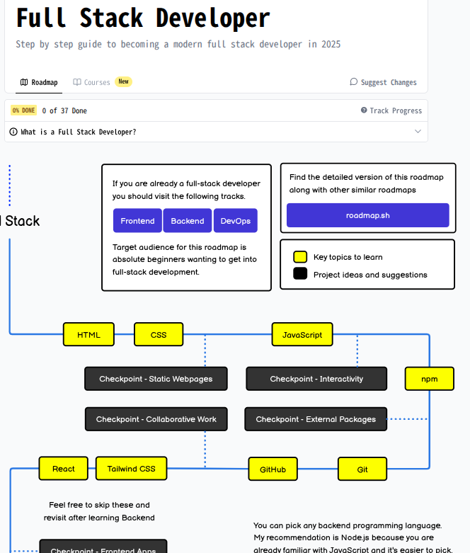
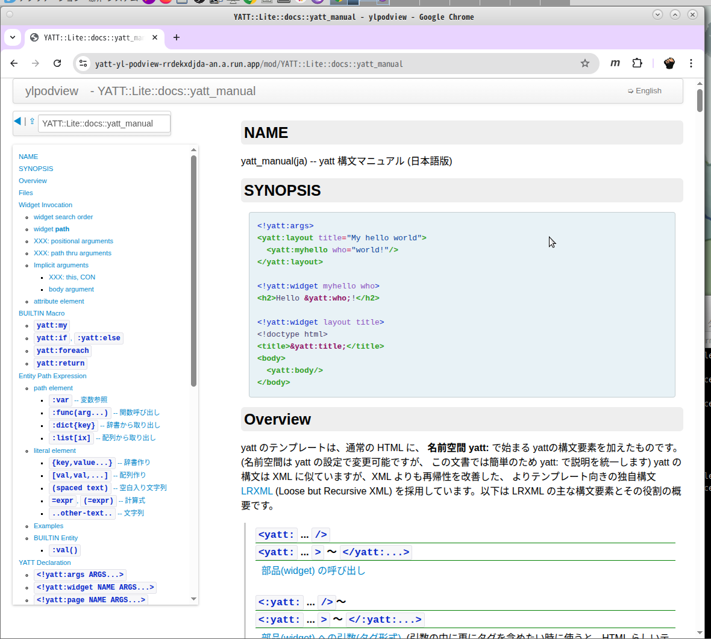

# 再び **HTML書き** を Web の主役<small>(?)</small>にする
## ための、テンプレートエンジン: [**YATT**](https://github.com/hkoba/yatt_lite)

[X: **@hkoba**](https://x.com/hkoba) （えちこば）、フリーランス<small>（一応）</small>

<small>仕事：[Perl](https://metacpan.org/author/HKOBA), Tcl/Tk, GCP 上の Linux サーバー管理etc... TypeScriptは勉強中</small>
<small>GitHub: [hkoba](https://github.com/hkoba)</small>
<small>ブログ：[hkoba](https://hkoba.hatenablog.com/).hatenablog.com</small>
<small>2023半ば、宮崎移住（木花地区）</small>

---

## 今日の資料 ＞

[hkoba](https://hkoba.github.io).github.io → [`Webナイト宮崎` `#21`](https://hkoba.github.io/slides/webnight-miyazaki21/slide.pdf)

## デモ環境 ＞

github.com/hkoba/[yatt-starter-html](https://github.com/hkoba/yatt-starter-html)

- Dockerfile あります

---

## （…Perl と聞いて、お気づきとは思いますが…）

# 世間のトレンドから、程遠い話です

お許し下さい＞＜

---

### さて本題…

---

# 昔は良かった…

- **HTML を書ける人** なら、誰でも

* **画面の原案** くらいは、自力で作れた

---

# 今の Web は
# 参入ハードルを
# 上げ過ぎでは…？

← https://roadmap.sh/full-stack

---

# 勉強すること、多すぎ！

---

とは言っても、<small>（一定レベル以上の）</small>Webサイトを作るなら

- <small>（静的 or 動的）</small>**テンプレートエンジン** は導入したい

* 理由：HTML だけですら…

  - 見た目の要求水準が上昇 ＝ 記述量が増えた

  * ページごとに書き換える箇所が沢山

    * 手作業だと負荷が大きい・漏れが出る

---

## けど一般的に、
# テンプレートエンジンは…

- 構文が…まぁまぁ難しい（HTML らしくない）ものが多い

---

### また、せっかく導入しても
# プログラムから、部品として呼ばれる
### だけのテンプレートだと

-  **HTML 書き**は、不自由なまま

* **自力で** 改善出来ることが少ない、主役感が無い

---

### そこで、
# YATT というテンプレートエンジン

### を作っています<small>（サーバーサイド、動的）</small>

* 極力、HTML らしさを保つ

* ファイルをポンと足せば動く

* 入力を間違ったら、すぐに lint が知らせてくれる

---

（〜ここで、デモに移動〜）

---

### 繰り返しですが…

- 任意のサンプル HTML を

- 適当なファイル名で、**ポンと置くだけ** で、動いて欲しい

  * （初期の PHP 的な世界観）

* **HTML 部品への括り出し** も、同レベルの操作にしたい

---

# YATT の場合

- ファイルを置けば、それが route になる

- HTML 部品の括りだしも、

  * 別のファイルに括りだして、

  * `<yatt:ファイル名 />` タグを書くだけ

     * <small>名前空間は `yatt:` 以外にも設定できます</small>

---

### 引数の扱いなど

[マニュアル](https://yatt-yl-podview-rrdekxdjda-an.a.run.app/mod/YATT::Lite::docs::yatt_manual)をご覧下さい

* <small>`XXX:` あちこち未完ですが…🙇</small>

---

### 10年以上も仕事に使って、改良を続けてます〜

# Yet Another Template Transpiler - YATT

- [YATT::Lite](https://github.com/hkoba/yatt_lite)  
<small>Perl 版</small>

* [yatt-js](https://github.com/hkoba/yatt-js)  
<small>TypeScript 版, まだまだ開発中（Pre α レベル）</small>

* 皆様のご意見を募集してます！

  - 一緒に Perl 書いてくれる人なども募集中！

  * あと、普通に友達ほしいっす！
