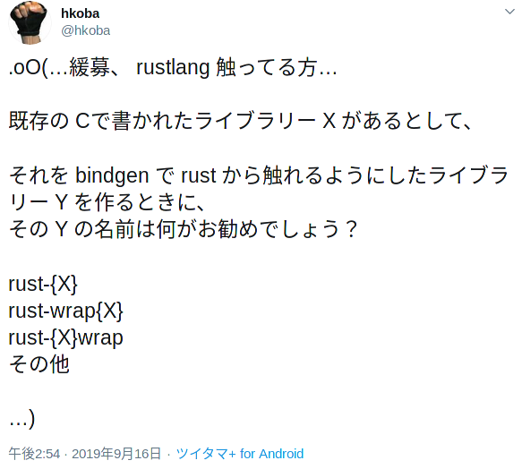

### Rust に入門したくて！
### libperl を bindgen して
### Perl の ASTを舐め始めた話


**@hkoba**  
[hkoba.github.io/](http://hkoba.github.io/)  
[`yapcjapan2019nagoya`](http://hkoba.github.io/slides/yapcjapan2019nagoya/)

___

<!-- .slide: class="tiny" -->

### 誰に何を話すか

- Rust に入門する話が一番広そう(背中を押してほしい人？)
  - 前提の再確認(置かれた立場、悩みを言語化して共有)
  - なぜ Rust ? (理由を言語化して欲しい)
  - どう Rust を導入する？(業務へ導入する戦略も、言語化して欲しい)
- Perl の内部に詳しい人を喜ばせつつ、そうでなくても置いていかれない。

---

## 今日、伝えたいこと

* <small>内部まで良く知った</small>ライブラリ<small>(C言語ベース)</small>が有る人<small>なら</small>
* <small>いきなり</small>FFI 書いて Rust 入門、<small>も有りかも</small>？

---

<!-- .slide: class="small" -->

### 自己紹介: hkoba


* 大昔、Perl/Tk の日本語化 <small>(1995〜96)</small>
* <small>(流行らなかった)</small> MMO ゲームのサーバー側開発 C++ <small>(1997〜2000)</small>
* 今は <small>(名ばかりの)</small> フリーランスな Perl屋
  - <p><small>**`"use strict"` なテンプレートエンジン**
  [YATT::Lite](https://github.com/hkoba/yatt_lite#yattlite---template-with-use-strict-) 作ってます(→[簡単な紹介](../langimpl1/index.html#/))</small></p>

---

### 今日の内容

1. 動機<small>（悩みは何？なんで libperl？なんで Rust ？）</small>
2. Rust への入門、体験記
  - <small>本当に使えるの？(技術検証)</small>
  - <small>bindgen してみた</small>
3. まとめ

---

# 1. 動機

---

## 1. 動機

- おっさんPerlプログラマーの悩み
- <small>個人的に、Perlで</small>限界を感じている点
- Rust を組み合わせると…？

---

### おっさんプログラマーの悩み

#### 心血注いで築き上げたライブラリ,経験etc資産が
#### `言語ごと流行から外れて`
#### 負債呼ばわりされる現実

### グギギ

---

<!-- .slide: class="small" -->

#### 近代的な/流行りの言語のメリットは、分かる
#### 型に守られたパターンマッチとか、欲しい

<small>ex. [MinCaml の inline.ml (抜粋)](http://esumii.github.io/min-caml/min-caml.html#inline_g)</small>


___

<small>
この `IfEq(x, y, e1, e2)` は `if x = y then e1 else e2`
</small>

http://esumii.github.io/min-caml/tutorial-mincaml-9.htm


---

### けど既存の資産の総書き直しは…
#### 難しい…

* 体力・時間
* 顧客にとっての価値は？？

---

### <small>個人的に、Perlで</small>限界を感じている点

### →静的なエラー検査が不十分<!-- .element: class="fragment" -->

---

### 注: Perlにも静的な型検査は有る

Since [perl5.005](https://metacpan.org/pod/distribution/perl/pod/perl5005delta.pod#fields)<small>(1998-07-22)</small>

```perl
package Position { use fields qw/line character/ };

my Position $pos = +{};
$pos->{characterrrr} = 8; # ←これは静的にエラーになる
```

※ `use strict` 前提

---

### …けど弱い…

```perl
# XXX: typo を見つけてくれない
my Position $p = +{line => 3, characterrrrr => 8};

# XXX: 引数/戻り値の型の mismatch は検出してくれない
# XXX Range が欲しい所に Position を渡してもエラーにならない
range_to_something(pos_of_foo($foo));

sub pos_of_foo { ...; my Position $pos =...; return $pos }
sub range_to_something { (my Range $range) = @_;  ... }
```

#### ↑これを検出できれば、もう少し戦えるのだけど…

---

#### … Perl は内部に AST を持ってますね …

[](https://perldoc.perl.org/5.30.0/perlinterp.html#OP-TREES)


---

#### 変数の型を取り出す内部APIも存在

[perldoc perlintern](https://perldoc.perl.org/5.30.0/perlintern.html#PadnameTYPE)


```C
	HV *	PadnameTYPE(PADNAME pn)
```


#### 内部APIを <small>(perl の `B::` モジュールか, C言語レベルで)</small>叩く事は可能

### ↑ ただ、それを書く時の<!-- .element: class="fragment" -->
### perl や C の型検査が弱いままでは…<!-- .element: class="fragment" -->


---


#### けど
## 近代的な言語で
#### Perl の AST を読める
### なら話が変わる

---

#### では
## なぜ Rust？

* 処理系A の GC `+` 別の処理系B のGC  
→ 深い注意が必要
* Rust は GC を押し付けない<small>（代わりに寿命を静的に型検査）</small>  
→ GC を持つ他の処理系とも、組合せやすそう

---

#### …Rust の変化も、そろそろ落ち着いたぽい？

[日本語で、本が出るくらいに…](https://gihyo.jp/book/2019/978-4-297-10559-4)

[](https://gihyo.jp/book/2019/978-4-297-10559-4)

---

### いっちょ触ってみますか！

---

# 2. Rust への入門
# 体験記

---

<!-- .slide: class="small" -->

### まず技術検証

1. **チュートリアル** には手を付ける<small>（最低限の知識を得る）</small>
2. 最も簡単そうな<small>（でも実現すると **個人的にアガる** ）</small>**目標** を定める
3. コード書く  
→ 動かない<small>(コンパイル通らない, SEGVする)</small>  
→ エラーメッセージで検索/本に戻って知識を補う  
→ ∞


---

<!-- .slide: class="small" -->

### 具体的には

1. チュートリアル：[The book](https://doc.rust-lang.org/book/title-page.html) <small>([日本語訳](https://doc.rust-jp.rs/book/second-edition/))</small>
  1. `Getting Started` <small>/ `事始め`</small>
  2. `Programming a Guessing Game` <small>/ `数当てゲームをプログラムする`</small>
2. 目標は `perl_parse()` 
3. [実践Rust入門](https://gihyo.jp/book/2019/978-4-297-10559-4)の `12章. FFI` を読みながら、perl_parse() を呼ぶコードを書いてみる
  - 理解に必要な語/概念が出てくる章を芋づる式に読む

---

### [perl_parse()](https://perldoc.perl.org/5.30.0/perlapi.html#perl_parse) とは

スクリプトのコンパイルだけを済ませるAPI

```C
int	perl_parse(PerlInterpreter *my_perl,
                  XSINIT_t xsinit, int argc,
                  char **argv, char **env)
```

使い方<small>[perlinterp.pod](https://metacpan.org/pod/distribution/perl/pod/perlinterp.pod#ELEMENTS-OF-THE-INTERPRETER) や [perlembed.pod](https://metacpan.org/pod/distribution/perl/pod/perlembed.pod#Adding-a-Perl-interpreter-to-your-C-program)参照</small>

```C
PerlInterpreter *my_perl = perl_alloc();

perl_construct(my_perl);

rc = perl_parse(my_perl, xs_init, argc, argv, (char **)NULL);

/* その後, perl_run(my_perl); */
```

---

`perl -c`  == `perl_parse()`

```sh
% perl -ce 'print "FOO\n";
if ;
print "BAR";
'
syntax error at -e line 2, near "if ;"
-e had compilation errors.
%
```


---

### ↓これを Rust でしたい

```C
PerlInterpreter *my_perl = perl_alloc();

perl_construct(my_perl);

rc = perl_parse(my_perl, xs_init, argc, argv, (char **)NULL));
```

`PerlInterpreter` をどうするか…

最短手は？


---

### 「[実践Rust入門](https://gihyo.jp/book/2019/978-4-297-10559-4)」に<small>書いてありました</small>

* `12-2-7` Opaque と空の列挙型
  - Opaque == 不透明, 中が見えない
  - ポインタの先のことは、Rust 側では関知しない、というアプローチ

---

`PerlInterpreter` と `XSINIT_t` は、これで行ける

```rust
enum PerlInterpreter {}
enum XsinitT {}
```

それへのポインタ

```rust
let my_perl: *mut PerlInterpreter = ...;
```

<small>(rust のコンパイラが名前の付け方に警告を出すので、この時はそれに従った)</small>

---

### 宣言は書けた？

```rust
extern "C" {
    fn perl_parse(
        my_perl: *mut PerlInterpreter,
        xsinit: *const XsinitT,
        argc: c_int,
        argv: *const *const c_char,
        env: *const *const c_char,
    ) -> c_int;
}
```

___

### 他の型

Cの文字、int、void

```rust
use std::os::raw::{c_char, c_int, c_void};
```

文字列へのポインタのポインタ<small>(C の `char** argv`)</small>

```
let my_argv: *const *const c_char = ...;
```

---

<!-- .slide: class="small" -->

### `char **argv` をどう作る？

```rust
use std::ffi::CString; // Rust で割り付けて C に貸す文字列

let s = CString::new("foo").unwrap();

let p = unsafe {s.as_ptr()};
```

↓こうしてみた。

```rust
fn cstr(s: &str) -> *const c_schar {
    CString::new(s).unwrap().as_ptr()
}

let args = vec![cstr("-e0"), ptr::null()];
```

---


## SEGV!


---

### ダメ元で gdb


### …あれ、読めそう…

---


C 側も Rust 側も普通に print 出来る…

### 普通に開発出来そう…<!-- .element: class="fragment" -->

---

* gdb で見て、理解
* lifetime を理解せずに CString を使って  
  SEGV したりゴミを渡したりが原因だった

---

* 最後は[StackOverflow の記事](https://stackoverflow.com/questions/34379641/how-do-i-convert-rust-args-into-the-argc-and-argv-c-equivalents)で解決


---

大体、こんなコードに

```rust
fn main() {
    let args = std::env::args().map(|arg| CString::new(arg).unwrap() )
      .collect::<Vec<CString>>();
    let c_args = args.iter().map(|arg| arg.as_ptr())
      .collect::<Vec<*const c_char>>();

    let my_perl = unsafe {perl_alloc()};
    unsafe {perl_construct(my_perl)};

    let _rc = unsafe {
        perl_parse(
            my_perl,
            ptr::null(),
            c_args.len() as c_int,
            c_args.as_ptr(),
            ptr::null()
        );
    };
    
    unsafe {perl_destruct(my_perl)};
}
```

`unsafe` の嵐！

---

### 動いた！


<small>ちゃんと `perl -c` と同じ働きをしてる！</small>

---

## 喜びの雄叫び！

[](https://twitter.com/hkoba/status/1159056109216288771)

---

<!-- .slide: class="tiny" -->

## 次は bindgen の検証

* AST を舐めるには Perl の内部構造にも Rust の型定義を与える必要が有る
* 手書きだと実用上は厳しいので…


---

### bindgen とは

C のヘッダから Rust のコードを生成するライブラリ

```rust
bindgen::Builder::default()
           .header("wrapper.h")
           .generate()
           .expect("Unable to generate")
           .write_to_file(out_path.join("bindings.rs"))
```

コマンド行でも試せる

```sh
% bindgen input.h -o bindings.rs
```

<small>
https://rust-lang.github.io/rust-bindgen/command-line-usage.html
</small>

---

→とりあえず呼んでみて、使用に耐えるか調べる

---

`wrapper.h` を書く。<small>↓(libperl だとこれだけ)</small>

```C
#include <EXTERN.h>               /* from the Perl distribution     */
#include <perl.h>                 /* from the Perl distribution     */
```

bindgen を試しに呼んで、出た Rust コードを眺める

```sh
% ccopts=($(
   perl -MExtUtils::Embed -e ccopts |
   perl -nle 'print for grep /^-[DI]/, split'
  )

% bindgen wrapper.h -- $ccopts | less
```

<small>ちなみに 1.5MB</small>

---

例えば `struct sv` <small>(perl 内部のスカラー値)</small>

```rust
#[repr(C)]
#[derive(Copy, Clone)]
pub struct sv {
    pub sv_any: *mut ::std::os::raw::c_void,
    pub sv_refcnt: U32,
    pub sv_flags: U32,
    pub sv_u: sv__bindgen_ty_1,
}
#[repr(C)]
#[derive(Copy, Clone)]
pub union sv__bindgen_ty_1 {
    pub svu_pv: *mut ::std::os::raw::c_char,
    pub svu_iv: IV,
    pub svu_uv: UV,
    pub svu_nv: NV,
    pub svu_rv: *mut SV,
    pub svu_array: *mut *mut SV,
    pub svu_hash: *mut *mut HE,
    pub svu_gp: *mut GP,
    pub svu_fp: *mut PerlIO,
    _bindgen_union_align: u64,
}
```

bindgenしゅごい…これを使えると楽…

---

#### ビルド→エラー出る


けど、redefined はおかしい

---

* 一部の定数の定義が、本当に二回出ていた。
* → 一方を手で削ってみる
* → ビルド通るじゃん？

---

#### → `::new()` とか `.parse()` とか書き始めてみる

```rust
fn main() {
    let mut perl = c_perl::PerlWrap::new();

    let _rc = perl.parse(std::env::args());
    
```

---

### 折角だから OP TREE を舐めてみるぜ！

```rust
    let mut op: *const c_perl::op = unsafe {(*perl.my_perl).Imain_start};

    while !op.is_null() {
        let ty = unsafe {(*op).op_type()};
        print!("op={:#?} {}\n",
               op, 
               unsafe {
                   CStr::from_ptr(c_perl::PL_op_name[ty as usize])
               }
               .to_str().unwrap()
        );
        op = unsafe {(*op).op_next as *const c_perl::op};
    }
```

`unsafe` の嵐！

---

[](https://twitter.com/hkoba/status/1173468427706490880)

---

### この楽しさを誰かと共有したい…

→コード公開しよう

___

<!-- .slide: class="small" -->

### でも名前はどうする？

* [perl](https://crates.io/crates/perl) という名前の crate は既にある
  - ただし用途は違う
    - 向こうは Perl → Rust
    - こちらは Rust → Perl

___

### 呟いてみた



___

#### RTしてもらえて、レスをもらえた！


---

<!-- .slide: class="tiny" -->

#### [`sys-` クレート](https://kornel.ski/rust-sys-crate)という
#### 命名慣習がある、と

https://kornel.ski/rust-sys-crate

> **\*-sys** is **a naming convention** for crates that help Rust programs use C ("system") libraries, e.g. libz-sys, kernel32-sys, lcms2-sys. The task of the sys crates is **expose a minimal low-level C interface** to Rust (FFI) and to tell Cargo how to link with the library. Adding higher-level, more Rust-friendly interfaces for the libraries is left to "wrapper" crates built as a layer on top of the sys crates (e.g. a "rusty-image-app" may depend on high-level "png-rs", which depends on low-level "libpng-sys", which depends on "libz-sys").

---

* `libperl-sys` 生の Perl API そのもの
* `libperl-rs` それを Wrap したもの

としてみました。

---

## 残る問題：移植性

---

* マルチスレッド対応の有無で `struct PerlInterpreter` の中身が別物に

```rust
// Imain_start が有るのは threaded 版の libperl のみ
unsafe {(*perl.my_perl).Imain_start};
```

* C では Cプリプロセッサマクロで差異を吸収する仕組み  
← bindgen ではカバーできない

---


---

* libperl
  - Perl の Configure で `-Duseshrplib` 
  - [Building a shared Perl library](https://metacpan.org/pod/distribution/perl/INSTALL#Building-a-shared-Perl-library)

* `-Dusethreads`

